# Rolodex — Complete Overview

> **For sharing with other AI systems.** This document is self-contained — paste it (or the whole `/Users/pilksclaes/rolodex AI/` folder) into any other AI tool and it should have full context. Last updated: 2026-05-08.

---

## 0. The 30-second pitch

Rolodex is the **AI relationship operating system**. It ingests every channel where a user's relationships live (iMessage, Gmail, Instagram, WhatsApp, Telegram, Facebook Messenger, TikTok, X, Calendar, Contacts), builds a **per-relationship tonal fingerprint** so it knows how *you specifically* talk to each person, and once a day surfaces a small ranked list of people you're at risk of losing — each with a draft message that sounds exactly like you wrote it.

- **Engine** runs on macOS (the only platform that can read iMessage).
- **iPhone app** is the daily approval surface (because users live on their phone).
- **Browser extension** (Phase 4) captures Instagram / Facebook / LinkedIn DMs that no API exposes.
- **Privacy is the moat:** local-first, end-to-end encrypted sync, never trains on user data.

Pricing: **$14 Personal / $49 Pro / $99/seat Teams**. Realistic ARR target: $1M in 18 months on Pro tier alone with ~1,700 customers (real estate agents, financial advisors, talent managers, recruiters).

---

## 1. What's been built in this session — file inventory

All files live in `/Users/pilksclaes/rolodex AI/`:

| File | Type | Lines | Status | Purpose |
|---|---|---|---|---|
| `app.html` | Interactive HTML dashboard | ~1,680 | ✅ Working with real data | Desktop / Mac dashboard. Apple-grade UI. Shows real people from iMessage, real iMessage-blue draft bubbles, real cadence/scoring. Includes Profile picker (Personal/Business) and Data Sources strip. |
| `mobile-app.html` | Interactive iPhone simulator | ~960 | ✅ Working interactive demo | 14-screen onboarding flow walkthrough. iPhone-shaped frame, native iOS aesthetic, click/tap/arrow-key navigation. Each permission screen has feature list + honest "how this works" amber note. |
| `landing.html` | Marketing site | ~1,180 | ✅ Deployable | Dark-mode hero, feature stack, 3-tier pricing ($14/$49/$99), FAQ, waitlist form. Drop on any domain. |
| `rolodex.json` | Data + schema | ~480 | ✅ Real data + v2 schema | Source-of-truth database. 13 real people seeded from Pilk's actual iMessage history. Schema v2 supports multi-channel, tone profiles, group threads, life events, multi-profile (personal vs business). |
| `ARCHITECTURE.md` | Engineering spec | ~330 | ✅ Build-ready | Production blueprint. Data sources truth table (what's possible, what isn't), Section 2.5 (iPhone permission flow per source), Tonal Model spec, Natural-End-of-Conversation Detector, Multi-device model, Privacy contract, 5-phase build plan, tech stack recommendation. |
| `PRODUCT.md` | Strategic brief | ~175 | ✅ Investor-ready | Positioning, target customers (B2C and B2B), pricing rationale, competitive landscape (Dex/Monaru/Clay/etc.), risks, GTM phases. |
| `OVERVIEW.md` | This document | — | ✅ Portable summary | What you're reading. |

**Total session output:** ~4,800 lines of HTML/CSS/JS + ~1,000 lines of markdown spec + a real seeded relational database.

---

## 2. What's REAL vs SPEC'D

### Real and working today
- **Dashboard prototype (`app.html`)** opens in any browser and runs interactively
- **Landing page (`landing.html`)** is shippable to a domain in under 20 minutes
- **iPhone onboarding mockup (`mobile-app.html`)** is a clickable demo with 14 screens
- **13 real people** in `rolodex.json` pulled from Pilk's actual iMessage history (73 threads ingested by his existing PILK MCP brain vault)
- **Schema** is production-grade, supports every concept in the spec
- **Architecture** is detailed enough that a Swift contractor could start building Phase 1 immediately

### Spec'd but not yet built
- The actual macOS Swift app (Phase 1, 8–12 weeks)
- The iPhone companion app (Phase 3)
- The Chrome/Safari extension for Instagram/FB/LinkedIn (Phase 4)
- The tonal-model fine-tuning pipeline
- The natural-end-of-conversation classifier
- Multi-device end-to-end-encrypted sync via CloudKit
- WhatsApp / TikTok / X export importers

---

## 3. ASCII Architecture Diagram

This is paste-anywhere. Drop into any AI system and they'll get it.

```
┌─────────────────────────────────────────────────────────────────────────────┐
│                          ROLODEX SYSTEM ARCHITECTURE                         │
└─────────────────────────────────────────────────────────────────────────────┘

  ┌──────────────────── DATA SOURCES (per-user, opt-in) ────────────────────┐
  │                                                                          │
  │  DIRECT-OAUTH (iPhone or Mac, no extra hardware):                        │
  │   Gmail · Google Calendar · Outlook · Telegram (MTProto) · X · Discord  │
  │                                                                          │
  │  MAC-COMPANION REQUIRED (Apple blocks iOS):                              │
  │   iMessage · SMS · macOS Contacts · Phone call history                   │
  │                                                                          │
  │  CHAT EXPORT UPLOAD (manual, legal, stable):                             │
  │   WhatsApp · Facebook Messenger (alt path) · TikTok DMs                  │
  │                                                                          │
  │  BROWSER EXTENSION (passive read-only capture during normal browsing):   │
  │   Instagram DMs · Instagram comments · Facebook Messenger (alt)         │
  │   LinkedIn profile activity                                              │
  │                                                                          │
  │  iOS NATIVE PERMISSION (instant):                                        │
  │   Apple Contacts · Apple Calendar · iCloud                               │
  │                                                                          │
  └────────────────────────────────┬────────────────────────────────────────┘
                                   │
                                   ▼
  ┌─────────────────────── INGESTION LAYER ────────────────────────────────┐
  │  • Mac Companion App (Swift) — reads chat.db, Contacts, CallHistory     │
  │  • OAuth Coordinator (iOS Swift + Mac Swift) — Gmail / Cal / etc        │
  │  • TDLib Wrapper — Telegram in-app login                                │
  │  • Chat Export Importer — parses WhatsApp .txt, FB messages.json, etc   │
  │  • Browser Extension (Chrome + Safari, Manifest V3) — IG/FB/LinkedIn    │
  │  • Reauthorization Manager — token refresh + UI prompt for re-auth      │
  └────────────────────────────────┬────────────────────────────────────────┘
                                   │
                                   ▼
  ┌──────────────────────── BRAIN (per-user) ──────────────────────────────┐
  │                                                                         │
  │  ┌──────────────────────┐  ┌──────────────────────┐                    │
  │  │ Stylometric Extractor│  │ Relationship Classify│  ← Claude Haiku    │
  │  │ (local, deterministic)│  │ family/friend/biz/etc│    (cheap)         │
  │  └──────────┬───────────┘  └──────────┬───────────┘                    │
  │             ▼                         ▼                                  │
  │  ┌──────────────────────────────────────────────────────────────────┐  │
  │  │  Tonal Profile per person:                                       │  │
  │  │   capitalization · punctuation · emoji rate · profanity rate     │  │
  │  │   avg msg length · shibboleth phrases · sign-off pattern         │  │
  │  │   topic graph · callbacks · sample messages                       │  │
  │  └──────────────────────────────────────────────────────────────────┘  │
  │                                                                         │
  │  ┌──────────────────────┐  ┌──────────────────────┐                    │
  │  │ Natural-End Detector │  │ Cadence + Scoring    │                    │
  │  │ (don't nag if thread │  │ priority = warmth +  │                    │
  │  │ ended naturally)     │  │ responsiveness +     │                    │
  │  │                      │  │ freshness_decay +    │                    │
  │  │                      │  │ life_event_proximity │                    │
  │  └──────────────────────┘  └──────────────────────┘                    │
  │                                                                         │
  │  ┌──────────────────────┐  ┌──────────────────────┐                    │
  │  │ Group-Thread Handler │  │ Life-Event Detector  │                    │
  │  │ (don't count group   │  │ birthdays · job ch.  │                    │
  │  │ chat as 1:1 cadence) │  │ travel · launches    │                    │
  │  └──────────────────────┘  └──────────────────────┘                    │
  └────────────────────────────────┬────────────────────────────────────────┘
                                   │
                                   ▼
  ┌──────────────────────── STORAGE LAYER ─────────────────────────────────┐
  │  • SQLite + SQLCipher (encrypted-at-rest) — Mac local                   │
  │  • CloudKit (E2E encrypted) — multi-device sync                         │
  │  • CRDT (Automerge) for conflict-free updates                           │
  │  • Optional self-hosted vault for paranoid users                        │
  │                                                                         │
  │  Schema includes: people · channels[] · tone_profile · group_threads    │
  │  · life_events · profile_membership · sensitivity_flags · notes         │
  └────────────────────────────────┬────────────────────────────────────────┘
                                   │
                                   ▼
  ┌────────────────────── DRAFT GENERATION ────────────────────────────────┐
  │  Input: target person · tone_profile · last 50 msgs · life events      │
  │  Model: Claude Sonnet 4.6 (always-approve gate before send)             │
  │  Output: 3 candidate drafts → score by stylometric match → top one     │
  │          shown in UI; user can regenerate, edit, snooze, send          │
  └────────────────────────────────┬────────────────────────────────────────┘
                                   │
                                   ▼
  ┌──────────────────── USER INTERFACE LAYERS ─────────────────────────────┐
  │                                                                         │
  │   ┌──────────────────────┐    ┌──────────────────────────────────┐    │
  │   │  Mac Dashboard        │    │  iPhone Companion                │    │
  │   │  (Swift / SwiftUI)    │ ←→ │  (Swift / SwiftUI)               │    │
  │   │                       │    │                                  │    │
  │   │  • Daily digest       │    │  • Daily push notification       │    │
  │   │  • Drafts list        │    │  • 3 drafts on home screen       │    │
  │   │  • Per-person profile │    │  • Tap to approve                │    │
  │   │  • Tone insights      │    │  • Profile picker (P/B)          │    │
  │   │  • Source settings    │    │  • Tap source = OAuth/import     │    │
  │   │  • Profile picker     │    │                                  │    │
  │   │  • Group thread mgmt  │    │  Built from mobile-app.html spec │    │
  │   │                       │    │                                  │    │
  │   │  Built from app.html  │    │                                  │    │
  │   │  prototype            │    │                                  │    │
  │   └───────────┬──────────┘    └──────────────────┬───────────────┘    │
  │               │                                   │                    │
  │               └───────────────┬───────────────────┘                    │
  │                               ▼                                         │
  │                  ┌─────────────────────────┐                           │
  │                  │  USER APPROVAL          │ ← always required        │
  │                  └────────────┬────────────┘                           │
  └────────────────────────────────┬────────────────────────────────────────┘
                                   │
                                   ▼
  ┌──────────────────────── SEND CHANNELS ─────────────────────────────────┐
  │  • iMessage (via Mac AppleScript / Messages framework)                  │
  │  • SMS (via Mac Continuity)                                             │
  │  • Gmail Send (via OAuth send scope)                                    │
  │  • Telegram (via TDLib)                                                 │
  │  • Other channels: draft only — user copy-pastes (Phase 1)              │
  └─────────────────────────────────────────────────────────────────────────┘
```

---

## 4. Mermaid version (renders in Notion, GitHub, ChatGPT canvas, etc.)

```mermaid
flowchart TB
  subgraph Sources["📥 DATA SOURCES (per-user opt-in)"]
    direction LR
    A1[Gmail · OAuth]
    A2[Google Calendar · OAuth]
    A3[Telegram · MTProto]
    A4[X · OAuth]
    A5[iMessage / SMS · Mac required]
    A6[macOS Contacts · Mac]
    A7[WhatsApp · chat export]
    A8[FB Messenger · export or extension]
    A9[Instagram DMs · browser extension]
    A10[TikTok DMs · data export]
    A11[LinkedIn · browser extension]
    A12[Apple Contacts/Cal · iOS native]
  end

  subgraph Ingest["⚙️ INGESTION LAYER"]
    B1[Mac Companion App<br/>Swift]
    B2[OAuth Coordinator]
    B3[TDLib Wrapper]
    B4[Chat Export Importer]
    B5[Browser Extension<br/>Chrome + Safari]
  end

  subgraph Brain["🧠 BRAIN per-user"]
    C1[Stylometric Extractor<br/>local, deterministic]
    C2[Relationship Classifier<br/>Claude Haiku]
    C3[Tonal Profile<br/>per person]
    C4[Natural-End Detector]
    C5[Cadence + Scoring]
    C6[Group-Thread Handler]
    C7[Life-Event Detector]
  end

  subgraph Storage["💾 STORAGE"]
    D1[(SQLite + SQLCipher<br/>local encrypted)]
    D2[(CloudKit E2E<br/>multi-device sync)]
    D3[(CRDT Automerge<br/>conflict-free)]
  end

  subgraph Draft["✍️ DRAFT GENERATION"]
    E1[Claude Sonnet 4.6]
    E2[3 candidates]
    E3[Stylometric scoring]
    E4[Top draft shown to user]
  end

  subgraph UI["📱 USER INTERFACE"]
    F1[Mac Dashboard<br/>SwiftUI]
    F2[iPhone Companion<br/>SwiftUI]
    F3[USER APPROVAL]
  end

  subgraph Send["🚀 SEND CHANNELS"]
    G1[iMessage via Mac]
    G2[Gmail send]
    G3[Telegram send]
    G4[Other: draft only]
  end

  Sources --> Ingest
  Ingest --> Brain
  Brain --> Storage
  Brain --> Draft
  Storage <--> UI
  Draft --> UI
  UI --> F3
  F3 --> Send
```



---

## 5. Real data state (from Pilk's actual iMessage history)

The `rolodex.json` is seeded with **13 real people** identified from 73 ingested iMessage threads in his PILK brain vault. Tier distribution:

| Tier | Count | Examples (anonymized phone-handles for paste-safety) |
|---|---|---|
| 1 — Inner Circle | 5 | Partner (1500+ msgs), Mom, Dad, Best Buddy, Tyler (brother) |
| 2 — Strong Ties | 4 | Cam (Skyway/NV business partner), St Pete buddy (1447 msgs), Bryce (talent), Juliet (managed creator) |
| 3 — Warm Contacts | 2 | Dustin (Chick-fil-A owner), Insurance friend (golf buddy + business interest) |
| 4 — Loose Ties | 2 | Payton (real-estate mentee), Maleah (faith-based photographer mentee) |

Each record contains: `channels[]`, `tone_profile`, `context`, `history`, `scoring`, `cadence`, `profile_membership` (personal/business), `sensitivity_flags`. The schema is in v2.0 — matches what the architecture doc specifies.

---

## 6. Key technical decisions made (and why)

| Decision | Why |
|---|---|
| **Mac as engine, iPhone as approval surface** | iOS literally cannot read iMessage / WhatsApp / IG DMs / FB DMs / TikTok DMs / X DMs from third-party apps. Apple + Meta + ByteDance all block this. There is no workaround. macOS is the only platform that can read iMessage's chat.db. |
| **Always-approve before send (no autonomy in v1)** | Users won't trust a system that texts on their behalf without seeing the message first. Trust unlocks faster autonomy in later phases. Also matches Pilk's standing rule `mem_e676305c5337`. |
| **Local-first storage; cloud sync optional** | The product accesses extremely sensitive data (everyone's contacts, every conversation). One leak kills the company. Local-first removes the surface area. |
| **Per-relationship tonal fingerprinting** | The make-or-break feature. Generic AI drafts read like spam. Tone-matched drafts read like the user wrote them. This is the differentiator vs. Dex / Monaru / Clay. |
| **Natural-end-of-conversation detector** | Without it, the system nags users about threads that ended naturally. Pilk explicitly raised this — "not all messages need a reply." |
| **Browser extension for IG / FB / LinkedIn** | Meta blocks DM API access for personal accounts. Browser extension passive capture is the only ToS-compliant, technically stable workaround. |
| **WhatsApp via chat export, not API** | WhatsApp has no personal-account API. Their own "Export Chat" feature is built-in and stable. Manual but durable. |
| **B2B Pro tier ($49/mo) as primary revenue** | Real estate agents, financial advisors, recruiters, talent managers — they already pay $50–200/mo for inferior tools. Clear ROI math (one re-activated client = 5 years of fees). Easier to sell than consumer. |
| **iMessage send via AppleScript / Messages framework on Mac** | Apple permits this with Full Disk Access + Automation permission. Sends from real phone number, syncs to iPhone via Continuity. |
| **Claude Haiku for classification, Sonnet for drafts** | Honors Pilk's standing rule (cheapest adequate model). Haiku is ~$0.003/msg classification. Sonnet is $0.15/draft — fine for daily 5-draft digest at scale. |

---

## 7. Hard constraints (these are facts, not preferences)

1. **Apple blocks iOS apps from reading any other app's messages.** Including iMessage, WhatsApp, Instagram, Facebook Messenger, TikTok DMs, X DMs. There is no entitlement, no permission, no workaround. Future iOS versions are unlikely to change this.
2. **Meta actively blocks Instagram and Facebook scraping.** Bot accounts get killed within weeks. Browser extension passive capture is the only stable approach.
3. **Apple does not allow background-running apps to silently send iMessages.** Every send requires the user to either initiate or approve. This is by design and won't change.
4. **WhatsApp Business API works only for businesses.** Personal accounts are explicitly excluded.

---

## 8. Open questions worth discussing with other AI systems

Use these as discussion prompts when sharing this overview elsewhere:

1. **Multi-tenancy without compromising local-first privacy.** How do you build a B2B/Teams product (shared books-of-business, admin controls, audit logs) without breaking the local-first promise that makes the consumer product trustworthy? Hybrid model?
2. **The "is the AI replying as me" ethical line.** When a draft is so good a recipient can't tell it's AI-assisted, where's the disclosure obligation? Does it differ if the user *did* press send and *did* read the message before sending?
3. **The cold-start problem for tonal modeling.** A new user has no message history with most contacts on day one. How do you bootstrap a meaningful tone profile from sparse data? Few-shot prompting from existing demographic priors? Cluster-based fallback?
4. **Compete-or-coexist with Apple Intelligence.** Apple is shipping AI deeply into Messages on iOS 18+. Does Rolodex's value prop survive when Apple itself nudges you to text people? Argument: Apple won't aggregate across third-party channels (IG, WhatsApp, Telegram). Counter: most users don't care about cross-channel.
5. **The "what if the recipient finds out" stress test.** If a friend learns you used Rolodex to text them, do they feel betrayed or charmed? The framing of the product pivots on this. (Hypothesis: "I had an AI help me remember to text you" lands like "I scheduled it in my calendar." The intent and approval matter more than the assist.)
6. **Phase 5 — does it become a CRM at scale?** When the Pro/Teams tier lands at 1000+ relationships per user, does this stop being a "personal CRM" and become indistinguishable from Salesforce? Should it embrace that or resist it?
7. **Voice.** Should there be voice-driven approval ("hey Rolodex, send the Tyler draft")? Apple Watch surface? AirPods Pro contextual prompt?
8. **The growth flywheel.** Single-player utility (your own rolodex) vs network effects (your contacts also use it). How do you build viral mechanics without compromising the privacy contract?

---

## 9. Suggested next steps (in order)

1. **User tests the prototypes locally.** Walk through `app.html` and `mobile-app.html` end-to-end. Note what feels off, what's missing, what's surprisingly good.
2. **Reconnect Gmail + Calendar in PILK Settings** so the multi-source enrichment can actually run on Pilk's real data. (This was blocked in this session — tokens expired.)
3. **Buy a domain (`rolodex.app` or `getrolodex.com`)** and ship `landing.html` to Vercel for ~$0 to start collecting waitlist signups. Validation, not commitment.
4. **Decide build path:**
   - DIY with Claude Code / Cursor (6–10 weeks, ~$0)
   - Hire Swift contractor with `ARCHITECTURE.md` as the spec ($25–40k, 8–12 weeks)
   - Find a co-founding engineer who'll build for equity
5. **Run 10 customer interviews** with the Pro-tier ICP (real estate agents, financial advisors, talent managers in Pilk's existing network). Specifically ask if they'd pay $49/mo. Real answers from real ICPs > internet speculation.
6. **Build Phase 1** (macOS app: iMessage + Contacts + Gmail + tonal model + daily digest with manual approve/send).

---

## 10. How to share this with another AI

**Option A — quickest:** Copy this entire `OVERVIEW.md` and paste it into another AI's chat. They'll have full context including the diagram (the ASCII version always renders).

**Option B — fullest:** Zip the entire `/Users/pilksclaes/rolodex AI/` folder (~75kb compressed) and upload it to whichever AI you're consulting. Most modern AIs (ChatGPT, Gemini, Grok) accept .zip or folder uploads and can read all the files.

**Option C — focused:** Share just the file most relevant to the question:
- Strategic / business question → `PRODUCT.md` + `OVERVIEW.md`
- Technical / engineering question → `ARCHITECTURE.md` + `rolodex.json`
- Design / UX question → `app.html` + `mobile-app.html` + screenshots
- Marketing / positioning question → `landing.html` + `PRODUCT.md`

---

*Authored in a single Cowork session on 2026-05-08. Built on Pilk's PILK MCP brain vault data (73 real iMessage threads). The 13 people in `rolodex.json` are anonymized to phone-handle level for paste-safety. Sensitive context was deliberately not surfaced in the dashboard or drafts per standing instruction `mem_9245f7b10c8a` (protect operator privacy).*
